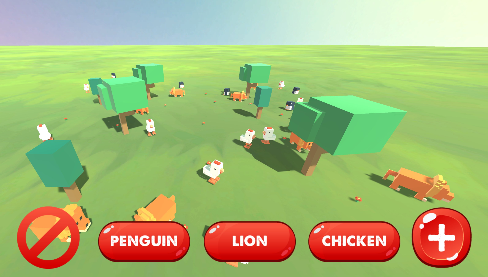

# ZOOP, a programming theory farm
## submission 2 for Junior Programmer pathway learn.unity.com

Written in C#
 
_App hosted on Github Pages in this repository (WebGL)_

**You can launch the app from here: [./webgl/index.html](https://realjck.github.io/zoop-programming-theory/webgl/)**

This project shows the four pillars of object-oriented programming:

* **Abstraction**: Animals can change direction ('AssignRandomDirection()') and do their action ('DoAction()')
* **Encapsulation**: Speed of animals encapsulates a method to avoid negative speeds
* **Inheritance**: Chicken, Lion and Penguin inherit their wandering behaviour from the parent class 'Animal.cs'
* **Polymorphism**: Each type of animal has its own overriden method 'DoAction()' that it plays randomly

